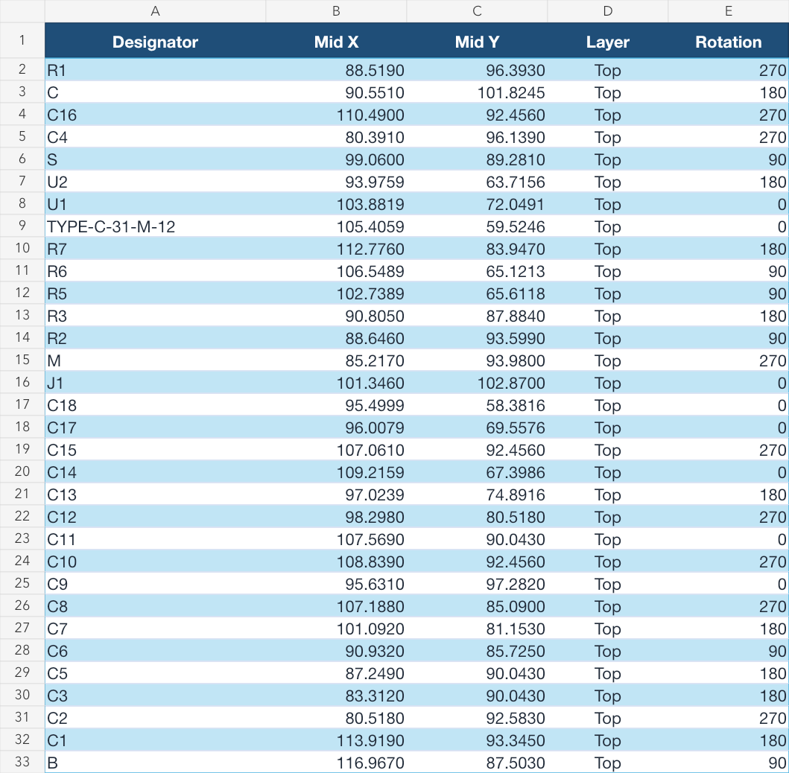
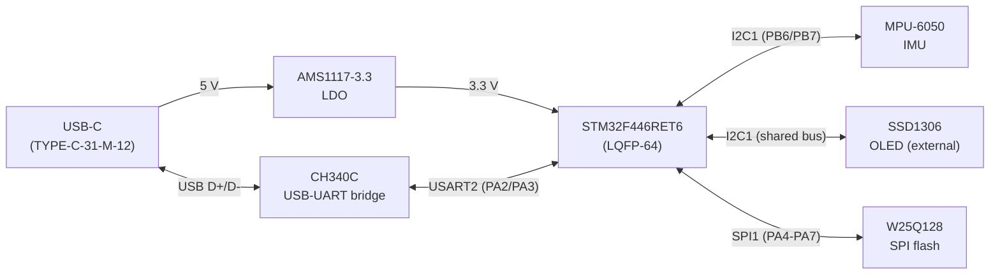

# STM32 Multi-Protocol IMU Data Logger

A custom two-layer STM32F446 PCB that samples an IMU over I²C, logs data to SPI flash, displays
status on an OLED, and streams telemetry through a USB-UART bridge — designed from first principles
in Altium and taken through schematic, layout, DRC, and a full manufacturing (Gerber/BOM/CPL) review.

> **Revision 1 status:** Schematic and PCB design are complete. ERC/DRC passed, and the Gerber,
> drill, BOM, and CPL packages were generated and reviewed for JLCPCB assembly. **Fabrication and
> electrical bring-up are pending** — the board has not yet been manufactured, assembled, or tested
> on hardware.

The point of the project is to demonstrate the electrical-level work a breakout module hides —
component selection, bus loading, pull-up sizing, decoupling, power, PCB layout, and design-rule
verification — not just firmware running on a dev board.

## Board preview



*JLCPCB placement preview of Revision 1 (top-side assembly).*

<!-- TODO after Altium export: hardware/exports/pcb-top.png, pcb-bottom.png, pcb-3d.png -->
<!-- TODO after fabrication: assembled-board photo + a 20–40s demo GIF (IMU motion -> live OLED
     values -> UART telemetry in a terminal -> logged samples read back from flash) -->

## System architecture



- **I2C1** — the MCU reads the MPU-6050 IMU and drives the SSD1306 OLED: two devices sharing one bus
  (bus loading, shared pull-ups, address arbitration).
- **SPI1** — the MCU logs data to the W25Q128 flash: a different bus with a different electrical
  model (push-pull vs. I²C's open-drain).
- **USART2** — debug/telemetry to a host terminal, carried over USB-C via the CH340C bridge. USB is
  transport only (like an FTDI cable); USART2 stays the demonstrated protocol.

## What I personally designed

**Authored from scratch:**
- Full schematic (STM32 support/reset/boot, power tree, USB-C + CH340C, three-peripheral bus design).
- PCB layout, routing, ground pour, and design-rule setup for JLCPCB 2-layer manufacturing.
- Custom Altium symbols/footprints where no vendor model existed (USB-C receptacle, CH340C, caps).
- All three peripheral drivers (`mpu6050`, `ssd1306`, `w25q128`) in C.
- The engineering calculations below (pull-up sizing, bus capacitance, decoupling, LDO dissipation).

**Generated / vendor-provided (not my work):** STM32 HAL and CMSIS, and the CubeMX-generated
peripheral init / MSP boilerplate under `firmware/Core/` and `firmware/Drivers/`.

## Hardware specifications

| Function | Part | Bus / Role |
|---|---|---|
| MCU | STM32F446RET6 (LQFP-64) | — |
| IMU | MPU-6050 (QFN-24) | **I2C1** |
| OLED display | SSD1306 (external module, not on PCBA) | **I2C1** (shared bus) |
| Flash | W25Q128 (SOIC-8) | **SPI1** |
| USB-UART bridge | CH340C (SOP-16) | **USART2** telemetry to host |
| Connector | Single USB-C (TYPE-C-31-M-12) | Power-in + UART transport |
| Regulator | AMS1117-3.3 (SOT-223) | 5 V → 3.3 V |

- **Board:** 2-layer FR-4, 1.6 mm, 1 oz copper, ENIG finish, ≈ 46.1 mm × 55.37 mm.
- **Manufacturing:** JLCPCB SMT assembly (parts chosen JLCPCB-Basic where possible). The reviewed
  Revision 1 release lives in [`hardware/manufacturing/rev1/`](hardware/manufacturing/rev1).
- Firmware was developed on a Nucleo-F446RE; the custom board moves to the bare STM32F446RET6.

## Firmware architecture & data flow

Bare-metal STM32 HAL, no RTOS. Each peripheral is an independent driver module:

| Module | File | Bus |
|---|---|---|
| MPU-6050 IMU | `firmware/Peripherals/i2c/mpu6050.{c,h}` | I2C1 |
| SSD1306 OLED | `firmware/Peripherals/i2c/ssd1306.{c,h}` | I2C1 |
| W25Q128 flash | `firmware/Peripherals/spi/w25q128.{c,h}` | SPI1 |

`main()` configures the clock and peripherals, initializes each device (reporting failures over
UART), then enters its loop.

**Intended end-to-end data path (not yet implemented):** sample the MPU-6050 at 100 Hz → show the
latest values on the OLED → append a timestamped record to flash → stream framed telemetry over
UART. This application loop, and the on-hardware bring-up behind it, are the main open firmware work
(see [Known limitations](#known-limitations--revision-2)).

## Engineering calculations & trade-offs

A few of the decisions reasoned from datasheets/first principles rather than copied from a reference
design (full derivations in the design notes):

- **I²C pull-ups (R1/R2):** from UM10204, `Rp(max) = tr / (0.8473 · Cb)` and
  `Rp(min) = (VDD − VOL) / IOL` give a valid window of **≈ 967 Ω – 17.6 kΩ**. Chose **2.2 kΩ** — well
  inside the window and available as a JLCPCB **Basic** 0402 part (`C25879`).
- **Bus capacitance:** device pin capacitance (~10 pF each) + trace capacitance (~0.11 pF, negligible)
  ≈ 20 pF, only ~5 % of the 400 pF Fast-mode budget — ample rise-time margin on the shared bus.
- **Decoupling:** values taken directly from each datasheet (STM32 per-pin 100 nF + 4.7 µF bulk +
  VCAP; MPU-6050 REGOUT/VDD/VLOGIC/CPOUT; flash 100 nF).
- **Power:** AMS1117-3.3 LDO, 22 µF Cin/Cout per its datasheet; worst-case ≈ 0.5 W on SOT-223 — fine
  with modest copper pour, no heatsink.
- **USB transport:** chose a discrete **CH340C** USB-UART bridge over native STM32 USB, so USART2
  stays the demonstrated protocol (no USB device stack) and the HSE crystal becomes optional. A
  single **USB-C** connector handles both power and UART; the earlier dual-port VBUS ORing scheme was
  dropped as unnecessary.

## Build & reproduce

**Firmware:**
```bash
cd firmware
make            # builds with arm-none-eabi-gcc; outputs under build/ (gitignored)
```

**Hardware:** open `hardware/altium/IMU sensor node hardware.PrjPcb` in Altium Designer. Manufacturing
outputs are regenerated from the project's OutJob (`IMU sensor node hardware.OutJob`); the reviewed
Revision 1 set is committed under `hardware/manufacturing/rev1/`.

## Verification results

- **Design verification (done):** schematic ERC clean; PCB DRC clean (with ShortCircuit and
  Board-Outline-clearance rules enabled); schematic-to-PCB comparison reviewed; JLCPCB matched all
  assembled BOM line items and previewed placement.
- **Hardware verification (pending):** power-rail, short-circuit, SWD, USB-UART, I²C, SPI, and
  firmware bring-up will be recorded after fabrication — planned under `docs/verification/` (logic-
  analyzer captures, measured I²C rise time vs. the calculated limit, SPI mode/clock, flash
  read/write/erase, power-rail measurements).

## Known limitations & Revision 2

**Hardware:** not yet fabricated, assembled, or electrically tested. The MPU-6050 is obsolete
(retained for Rev 1 because it's still JLCPCB-stocked) — migrate to a current IMU in Rev 2. The
1×5 SWD header (J1) is excluded from PCBA and hand-soldered.

**Firmware (open items before it can be called validated):**
- The main loop is empty — the end-to-end sample→display→log→stream application is not implemented yet.
- `SystemClock_Config()` currently runs the core from the **16 MHz HSI with no PLL**, not the 180 MHz
  the dev log mentions; the PLL config needs to be added.
- **PA4 chip-select conflict:** the SPI1 MSP configures PA4 as `GPIO_AF5_SPI1` (hardware NSS) after
  `MX_GPIO_Init` set it as a GPIO output, so the flash driver's software CS (`HAL_GPIO_WritePin`)
  can't drive it. PA4 needs to stay a plain GPIO output.
- Several flash SPI transfers don't check `HAL_SPI_Transmit/Receive` return codes.
- `W25Q128_Init` verifies only the JEDEC manufacturer byte — check the full ID.
- The CubeMX `.ioc` is not committed (currently gitignored), so the pin/clock config isn't reproducible.

## Repository structure

```
firmware/
├── Core/             # CubeMX-generated HAL core (main, clock, MSP, startup)
├── Drivers/          # STM32 HAL & CMSIS
├── Peripherals/      # Authored drivers — i2c/ (MPU6050, SSD1306), spi/ (W25Q128)
└── Makefile
hardware/
├── altium/           # Altium source design (.PrjPcb, .SchDoc, .PcbDoc, .BomDoc, .OutJob, libraries/)
├── manufacturing/
│   └── rev1/         # Reviewed release: gerbers.zip, bom.xlsx, cpl.xlsx
└── exports/          # schematic.pdf, PCB placement preview (renders TODO)
docs/
├── datasheets/       # MPU6050, SSD1306, W25Q128, STM32F446RE
└── wiring/
tests/
└── loopback/         # Protocol loopback tests
```

## License

MIT — see the follow-up `LICENSE` file for the authored firmware, hardware design, and drivers.
STM32 HAL/CMSIS retain their original STMicroelectronics licenses.

## Changelog

### 2026-07-21 — Revision 1 manufacturing-ready

- Altium design finalized: ERC/DRC clean, Gerbers (corrected key-shaped outline), drill, BOM, and CPL
  generated and reviewed in JLCPCB; placement previewed. Board ≈ 46.1 × 55.37 mm, 2-layer, ENIG.
- MPU-6050 exposed-pad footprint corrected (no paste/routing/vias beneath the die pad; continuous
  bottom GND plane kept for shielding).
- Power/UART path finalized: single USB-C, CH340C USB-UART bridge on USART2 (3.3 V, no level shift),
  AMS1117-3.3 LDO. HSE crystal made optional.
- I²C pull-ups set to 2.2 kΩ (`C25879`, JLCPCB Basic).
- JLCPCB quote $185.35; order deferred for budget. J1 excluded from PCBA (hand-soldered).
- Repository: imported the Altium project and published the reviewed Rev 1 manufacturing release
  under `hardware/`.

### 2026-07-08 — Pre-Altium design phase

Worked through every schematic decision from first principles before entering Altium — I²C trace
width, bus capacitance vs. the 400 pF ceiling, pull-up sizing, W25Q128 SPI mode, and the STM32
crystal/reset/boot/decoupling support circuitry. (The 1.5 kΩ pull-up chosen here was later revised to
2.2 kΩ for JLCPCB Basic-tier sourcing.)

### 2026-04-30 – 2026-06-30 — Firmware drivers

MPU-6050 (I²C), SSD1306 (I²C), and W25Q128 (SPI) drivers written and iterated on the Nucleo-F446RE;
Makefile build system; peripheral init and error reporting in `main.c`. See `DEVLOG.md` for the
detailed per-commit history.
